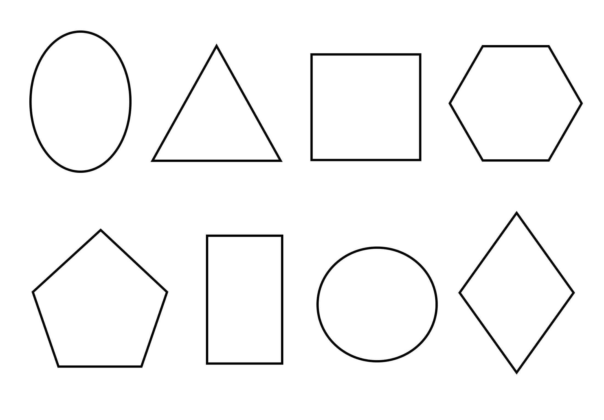
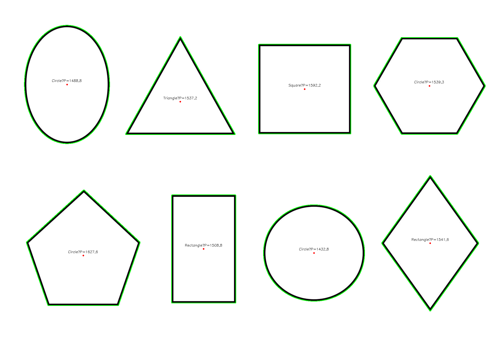
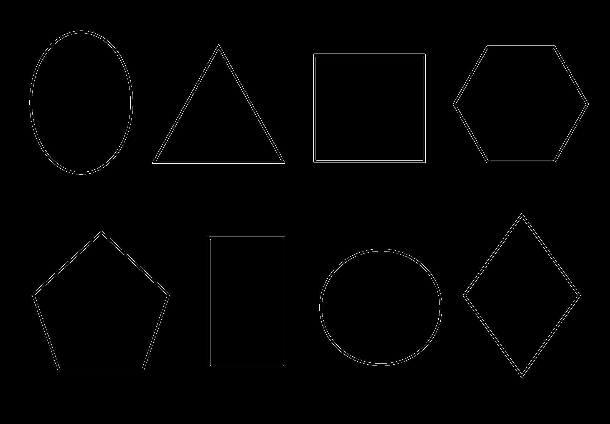

# Контурный анализ и распознавание геометрических фигур с помощью OpenCV

Программа выполняет поиск контуров на изображении с использованием детектора границ Кэнни, вычисляет геометрические характеристики объектов (периметр, центр масс) и определяет тип фигуры (круг, треугольник, квадрат, прямоугольник). Результаты визуализируются наложением контуров, отметок центров и текстовых подписей.

## Реализовано

- Загрузка изображения и предварительная обработка:
  - Преобразование в оттенки серого.
  - Размытие по Гауссу для подавления шума.
  - Выделение границ методом **Canny**.
  - Морфологическое закрытие (`MORPH_CLOSE`) для соединения разорванных участков контуров.
- Поиск контуров (`findContours`) и фильтрация по минимальной площади (исключение шумов).
- Для каждого найденного объекта:
  - Вычисление **периметра** (`arcLength`).
  - Определение **центра масс** через пространственные моменты.
  - Аппроксимация контура многоугольником и классификация фигуры:
    - Треугольник (3 вершины).
    - Квадрат / прямоугольник (4 вершины, с проверкой соотношения сторон).
    - Круг (на основе коэффициента округлости *circularity* > 0.75).
    - Многоугольник (в остальных случаях).
- Отрисовка контуров, центров масс и текстовых меток с названием фигуры и периметром непосредственно на изображении.
- Сохранение результирующего изображения и карты границ Кэнни.
- Вывод подробной информации о каждой фигуре в консоль.

## Запуск программы

1. Убедитесь, что в папке с исполняемым файлом (или в системном PATH) присутствуют следующие DLL-файлы OpenCV:
   - `opencv_world480.dll`
   - `opencv_world480d.dll` (для отладочной сборки)
2. Запустите `main.exe`.
3. На экране откроются окна:
    -   `Original`: исходное изображение.
    -   `Edges (Canny)`: результат работы детектора границ.
    -   `Result`: итоговое изображение с выделенными контурами, центрами масс и подписями.
4. В папке с программой будут сохранены файлы `result.png` и `edges.png`.
5. Для завершения работы программы нажмите любую клавишу, когда фокус находится на одном из окон OpenCV.

## Используемые функции OpenCV

| Функция | Назначение |
|---------|------------|
| `imread()` | Загрузка изображения |
| `cvtColor()` | Преобразование BGR -> Grayscale |
| `GaussianBlur()` | Размытие для снижения шума |
| `Canny()` | Детектор границ Кэнни |
| `getStructuringElement()` + `morphologyEx()` | Морфологическое закрытие контуров |
| `findContours()` | Поиск контуров на бинарном изображении |
| `contourArea()`, `arcLength()` | Вычисление площади и периметра |
| `moments()` | Вычисление моментов для определения центра масс |
| `approxPolyDP()` | Аппроксимация контура ломаной линией |
| `boundingRect()` | Построение ограничивающего прямоугольника |
| `drawContours()`, `circle()`, `putText()` | Визуализация результатов |
| `imwrite()`, `imshow()` | Сохранение и отображение изображений |

## Результат работы

```
Найдено контуров (до фильтрации): 8
Фигура 1: Circle | Периметр = 1432.76 | Центр = (1373.04, 1107.92)
Фигура 2: Rectangle | Периметр = 1508.83 | Центр = (890.5, 1090.01)
Фигура 3: Circle | Периметр = 1627.58 | Центр = (363.816, 1119.26)
Фигура 4: Rectangle | Периметр = 1541.6 | Центр = (1881.26, 1065.19)
Фигура 5: Square | Периметр = 1592.24 | Центр = (1332, 389.504)
Фигура 6: Circle | Периметр = 1539.31 | Центр = (1877.91, 375.914)
Фигура 7: Triangle | Периметр = 1537.17 | Центр = (788.301, 445.242)
Фигура 8: Circle | Периметр = 1488.76 | Центр = (292.557, 369.546)
Всего распознано фигур: 8
```

| Результат |
|-----------|
|  |
|  |
|  |